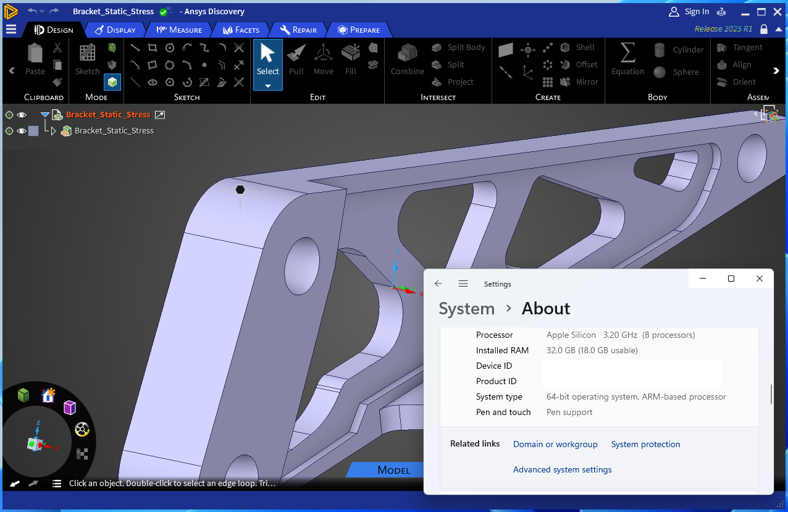

# Ansys Discovery D3D Enabler
Forces Ansys Discovery to use Direct3D 11 instead of OpenGL 4.6, making it run in Parallels on Apple Silicon.

## Installation
1. Build the project or use the pre-compiled EXE from Releases
1. Copy `DiscoveryLoader.exe` and `DiscoveryLoader.exe.config` to the same folder as `Discovery.exe` (usually `C:\Program Files\ANSYS Inc\v251\Discovery`)
1. Run `DiscoveryLoader.exe`

## Uninstallation
1. Delete `DiscoveryLoader.exe` and `DiscoveryLoader.exe.config`

## Testing
Tested on Ansys Discovery 2025 R1 25.1 only.

## Limitations
Only the Modeling configuration is supported, other configurations require hardware support and fail to initialize. It's likely this approach will break in the future versions when the API changes or the Direct3D support is removed.

## How does it work?
It exploits the fact that Direct3D 11 support is still in the code, it's just turned off so that it can't be configured from the outside. The loader bypasses this artifical limitation by loading the EXE and making all the necessary configuration changes through reflection in the runtime. Ansys files are not modified in any way, you can still use the original EXE alongside this launcher.